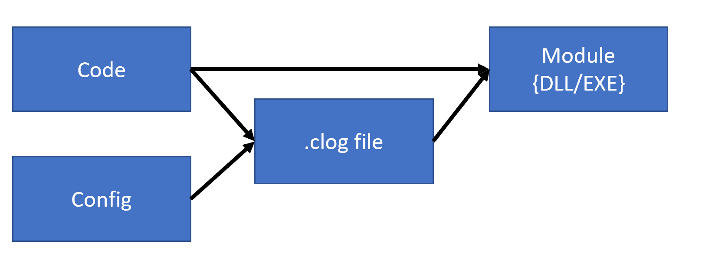
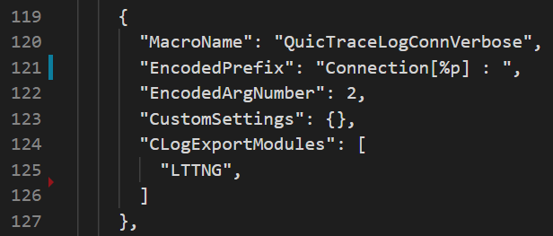

# At a high level, whats the problem?
* Backend infra, analysis tooling, and trace API are tightly coupled - lots of duplicated work
* Product/OS needs often dictate bit encoder - which leads to the cart(encoder) leading the horse (API/tools)
* Once you've chosen API, you're basically locked for life
* Windows has at least 3 bit encoders - and they're basically 

# Tracing on Windows
|              |   OS    | Capability         | printf() style | Manifest Location | Popular |
|--------------|---------|--------------------|------------|------------|
| Manifested   | Windows | DiagTrack/OneTrace | No | External/OnBox | No; hated by all but FUN |
| Tracelogging | Windows | DiagTrack/OneTrace | No | Internal to event | Equally uncomfortable |
| WPP          | Windows | -                  | Yes | External/PDB | Loved by all but FUN|
| Lttng        | Linux   | -                  | No | Yes| No; universally disliked but accepted |
| printf()     | All     | -                  | No | Yes| OMG :/ |
|-----------|

# CLog Interesting Decisions (ones with lots of thought)
* Decouples the API surface from the bit encoder
* API choice should introduce *zero* instructions; ruling out inheritance
* Durable ID's are always required to support tooling
* Events should be created with zero friction to the programmer; manifests are friction
* Debugging strings shouldnt ship, unless you want to
* Tools should be usable, no matter if the bit encoders change
* Existing tooling should continue to work, so long as the tooling and bit encoders are compatible

# Universal CLog Workflow

# What goes into config file?
* Macro Name
* Encoding types (8bit, 16bit, 32bit, 64bit, 128bit, guid, string types, and binary)
* Decoding instructions - including option to create your own decoder in C#

    
# What goes into source file?
* #include "file.cpp.clog" <-- generated by CLOG
* link CLOG lib (not always required)
* event fully described within the printf() macro

# Demo Work flow
1. at build time, your c/cpp file will be read and processed using a config file.  clog.exe produces .c file and .h file that contains the OS specific code for your OS
2. Using your favorite OS collection mechanism, collect traces using the appropriate tools
3. For debugging, convert your recorded traces into something human readable using one of the clog2text_{windows,lttng,etc} tools
